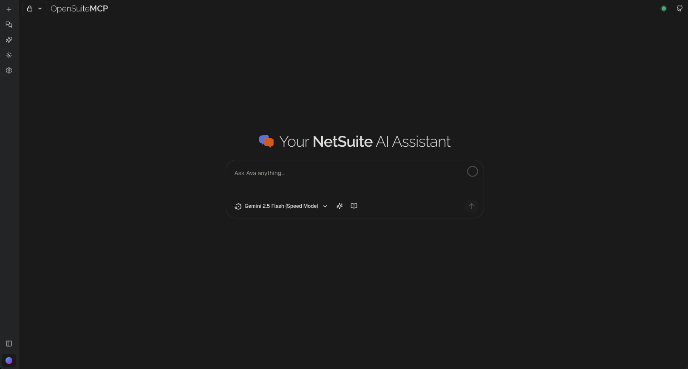
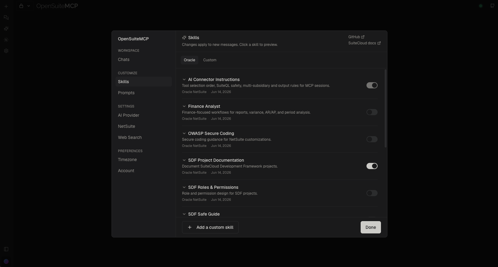
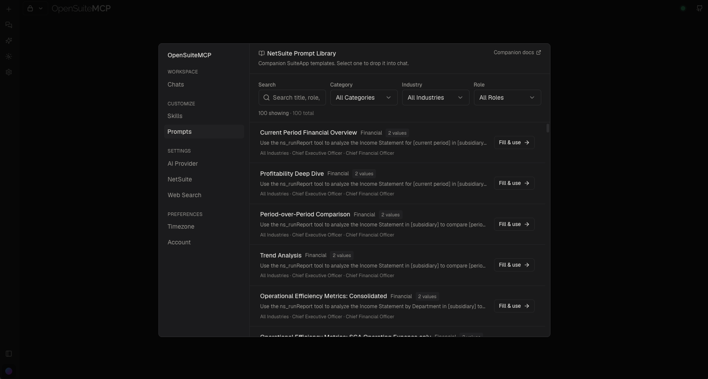
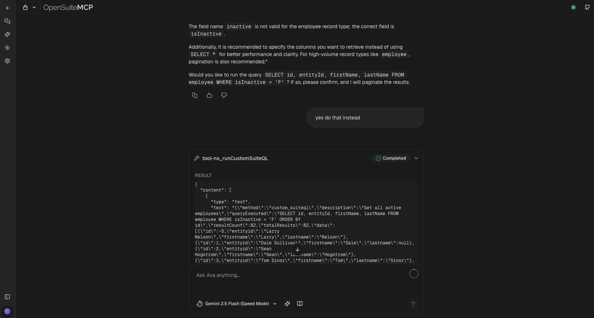

#  <span style="font-weight: 200;">OpenSuite</span>MCP

Open-source **NetSuite MCP client** — chat UI for NetSuite’s AI Connector Service, MCP Standard Tools, Companion prompt library, and SuiteCloud Agent Skills.

Bring your own LLM keys (**Google Gemini**, **Anthropic Claude**, or **OpenAI GPT**). Self-host for internal use. Commercial rights reserved by [Unstacked Apps, LLC](https://www.unstackedapps.com/).

**Current release:** [v3.0.0](https://github.com/unstackedapps/opensuitemcp/releases/tag/v3.0.0) · [Changelog](CHANGELOG.md)



_Main chat UI._

## What’s in 3.0

- **App Portal** — Chats, Skills, Prompts, AI Provider, NetSuite, Web Search, Timezone, and Account in one panel
- **SuiteCloud Agent Skills** — Oracle pack + custom `SKILL.md`; toggle into the system prompt per session
- **Companion Prompt Library** — Browse, fill placeholders, send into chat
- **NetSuite MCP** — Multi-account connect (DCR), status chip, live tool calls
- **BYOLLM** — Your API keys; no shared multi-tenant model account in this app

## Skills

Open **Skills** from the App Portal (or the sidebar). Enable Oracle SuiteCloud Agent Skills and/or your own custom skills. Enabled skills are injected into the system prompt for **new** messages — useful for finance analyst workflows, SuiteScript / SDF guidance, OWASP patterns, and more.

Custom skills: add a `SKILL.md`-style document in the portal; toggle it like any Oracle skill.



_Skills panel — Oracle pack and custom skills._

Pack source: [oracle/netsuite-suitecloud-sdk — agent-skills](https://github.com/oracle/netsuite-suitecloud-sdk/tree/master/packages/agent-skills)

## Prompts

Open **Prompts** for the Companion SuiteApp library (requires NetSuite connected with Companion available). Filter by category, industry, or role; open a template; fill required placeholders; then use it in chat.



_Companion prompt library — browse and fill-in._

Docs: [Companion SuiteApp](https://docs.oracle.com/en/cloud/saas/netsuite/ns-online-help/article_9091153093.html)

## NetSuite MCP tools

With AI Connector + MCP Standard Tools connected, chat can run SuiteQL, records, reports, saved searches, and related MCP tools against your account.



_NetSuite MCP tools in a conversation._

## Prerequisites

- Node.js 18+ and [pnpm](https://pnpm.io)
- PostgreSQL
- Docker (optional) for local Redis / SearXNG via `pnpm setup:backend`
- A NetSuite account with:
  - [AI Connector Service](https://docs.oracle.com/en/cloud/saas/netsuite/ns-online-help/article_7200233106.html) enabled
  - [MCP Standard Tools](https://docs.oracle.com/en/cloud/saas/netsuite/ns-online-help/article_0902023450.html) SuiteApp
  - [Companion SuiteApp](https://docs.oracle.com/en/cloud/saas/netsuite/ns-online-help/article_9091153093.html) if you want the prompt library
- An API key from Google, Anthropic, or OpenAI

## Quick Start

1. **Install dependencies**

   ```bash
   pnpm install
   ```

2. **Run automated setup**

   ```bash
   pnpm setup:backend
   ```

   Generates secrets, creates `.env.local`, and can start Docker services (PostgreSQL, Redis, SearXNG).

3. **Migrate the database**

   ```bash
   pnpm db:migrate
   ```

4. **Start the dev server**

   ```bash
   pnpm dev
   ```

   App: [http://localhost:3000](http://localhost:3000)

5. **Configure in the App Portal** (sidebar icons open the same portal)

   - **AI Provider** — Choose Google / Anthropic / OpenAI and enter your API key (stored encrypted)
   - **NetSuite** — Add an account ID, complete Integration / DCR setup, connect
   - **Skills** — Enable Oracle and/or custom skills for new messages
   - **Prompts** — Browse Companion templates when NetSuite + Companion are available

## NetSuite setup (short)

1. In NetSuite, ensure AI Connector and the MCP Standard Tools SuiteApp are available for your account.
2. In OpenSuiteMCP → **NetSuite**, add your account ID (e.g. `1234567` or `1234567-sb1`).
3. Follow the in-app Integration instructions (admin once per account), then **Connect**.
4. Confirm the header status chip shows connected before running SuiteQL / record tools.

Official references:

- [AI Connector Service](https://docs.oracle.com/en/cloud/saas/netsuite/ns-online-help/article_7200233106.html)
- [MCP Standard Tools](https://docs.oracle.com/en/cloud/saas/netsuite/ns-online-help/article_0902023450.html)
- [Companion SuiteApp](https://docs.oracle.com/en/cloud/saas/netsuite/ns-online-help/article_9091153093.html)
- [SuiteCloud Agent Skills](https://github.com/oracle/netsuite-suitecloud-sdk/tree/master/packages/agent-skills)

## Usage limits (optional)

Self-host defaults are generous. Override with env vars if needed:

| Variable | Default (OSS) | Purpose |
| --- | --- | --- |
| `MAX_MESSAGES_PER_DAY_REGULAR` | `100` | Signed-in user messages / 24h |
| `MAX_MESSAGES_PER_DAY_GUEST` | `20` | Guest messages / 24h |
| `CHAT_BURST_LIMIT_PER_MINUTE` | unset / `0` (off) | Redis burst cap; fail-open if Redis is down |

## License & notices

Self-host and internal use are welcome. **Commercial use of this codebase is reserved by Unstacked Apps, LLC.**

- [LICENSE](LICENSE) — Sustainable Use License
- [NOTICE.md](NOTICE.md) — Usage notice
- [ATTRIBUTION.md](ATTRIBUTION.md) — Third-party credits
- [CHANGELOG.md](CHANGELOG.md) — Release history

Hosted product (separate from this repo): [opensuitemcp.com](https://opensuitemcp.com)
